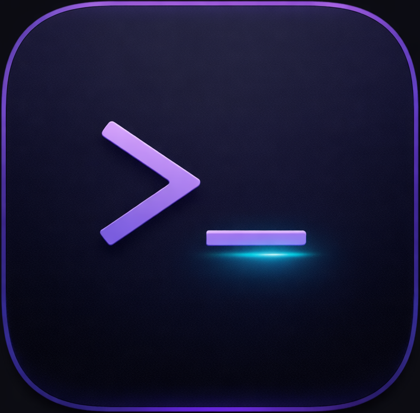

<p align="center">
  
</p>

<h1 align="center">Sevvi</h1>

<p align="center">
  <strong>Your terminal, your way.</strong><br>
  A modern, customizable terminal emulator for macOS.
</p>

<p align="center">
  <a href="#install">Install</a> &bull;
  <a href="#features">Features</a> &bull;
  <a href="#shortcuts">Shortcuts</a> &bull;
  <a href="#building">Building</a> &bull;
  <a href="#license">License</a>
</p>

---

## Install

### Download

Download the latest `.dmg` from [Releases](https://github.com/sevarm55/sevvi/releases).

### Build from source

```bash
git clone https://github.com/sevarm55/sevvi.git
cd sevvi
npm install
npm run build
```

The `.app` will be in the `release/` directory.

## Features

### Terminal
- GPU-accelerated rendering via xterm.js
- Split panes (horizontal & vertical) with drag-to-resize
- Multiple tabs with sidebar session management
- Custom Sevvi prompt engine with **41 prompt styles**
- Nerd Font support (bundled JetBrainsMono Nerd Font Mono)

### Customization
- **27 color themes** including Dracula, Nord, Tokyo Night, Catppuccin, Gruvbox, Rose Pine, Claude, CRT Green, and more
- **41 prompt presets** from Powerline to Zen to P10k-style
- Adjustable opacity and blur (native macOS vibrancy)
- Terminal padding controls
- Minimal mode (hide everything except terminal)
- Hide traffic lights (show on hover)
- Toggle sidebar (`Cmd+B`)

### Interface
- Command palette (`Cmd+P`)
- Keyboard shortcuts cheatsheet (`Cmd+/`)
- Separate Settings window (doesn't block terminal)
- Welcome screen with Orbitron typography
- macOS native window controls

### Prompt Styles

Sevvi includes a custom zsh prompt engine with 41 styles:

**Powerline family** — Powerline, Power Round, Power Mono, Power Neon, Power Gradient, Power Cyber, Power Ocean, Power Forest, Power Split, Power Mini, Power Blocks

**P10k-inspired** — P10k Rainbow, P10k Lean, P10k Classic, P10k Pure, P10k Lean 8, Robby Russell, Extravagant, P10k Spartan, Transient, Two-Line Frame

**Creative** — Glitch, Typewriter, Radar, Wave, Pixel, Noir, Tokyo, DNA, Pulse, Frost, Fire, Circuit, Rune, Starship, Binary, Spectrum, Bamboo, Classic macOS, Stacked, Ghost

### Color Themes

Sevvi, Dracula, Monokai, Nord, Solarized, Tokyo Night, Catppuccin Mocha, Catppuccin Latte, Gruvbox Dark, One Dark, Rose Pine, Kanagawa, Everforest, Ayu Dark, Ayu Mirage, GitHub Dark, Material, Synthwave, Cyberpunk, Midnight, Palenight, Nightfox, Vesper, Poimandres, Claude, CRT Green, CRT Amber

## Shortcuts

| Shortcut | Action |
|----------|--------|
| `Cmd+T` | New Tab |
| `Cmd+W` | Close Tab |
| `Cmd+Shift+]` | Next Tab |
| `Cmd+Shift+[` | Previous Tab |
| `Cmd+D` | Split Horizontal |
| `Cmd+Shift+D` | Split Vertical |
| `Cmd+Opt+Arrows` | Navigate Panes |
| `Cmd+B` | Toggle Sidebar |
| `Cmd+P` | Command Palette |
| `Cmd+,` | Settings |
| `Cmd+/` | Shortcuts |
| `Cmd+=` | Zoom In |
| `Cmd+-` | Zoom Out |
| `Cmd+0` | Reset Zoom |

## Tech Stack

- **Electron** — App shell
- **xterm.js** — Terminal rendering
- **node-pty** — Pseudo-terminal (shell process management)
- **TypeScript** — Type-safe code
- **electron-builder** — macOS app packaging

## Building

### Requirements

- Node.js 18+
- npm
- macOS (for building .app)

### Development

```bash
npm install
npm run dev
```

### Production build

```bash
npm run build
```

### Install to /Applications

```bash
cp -R release/mac-arm64/Sevvi.app /Applications/
```

## License

[MIT](LICENSE) - Sevvi is free and open source.
